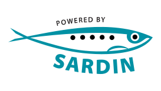
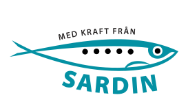

# Sardin 1.0

**NB! This is a placeholder for the Sardin release. We're still removing some code snippets that are causing problems, and updating the documentation to fit the release. We expect the initial release to be properly live on March 9.**

Public repository for **Sardin**, 
speech-oriented text processing software 
(primarily for Swedish)

Please note that this is the first release of Sardin. 
The resource is under active development and will be 
continuously refined and updated.

# Repo contents
 
- Documentation can be found in 
`/docs`.
- The code, tests, and code documentation are in  
`/p5m`.

# Attribution and citations

Sardin is released under 
the Apache 2.0 license.

In addition, we kindly ask users to cite:

_Christina Tånnander & Jens Edlund_ (2022): **Sardin: speech-oriented text processing**. 
In Procs. of the XXXIIIrd Swedish Phonetics Conference.
(Fonetik 2022).
Stockholm. 
([PDF](https://2022.fonetik.se/contributions/T%C3%A5nnander%20and%20Edlund%20-%202022%20-%20Sardin%20speech-oriented%20text%20processing.pdf))

And finally, you are free and encouraged to use 
the "Powered by Sardin"/"Med kraft från Sardin" logos found under
`docs/logos`:

